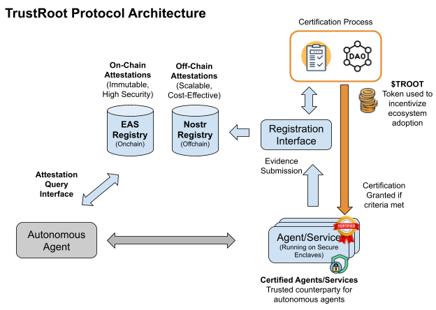
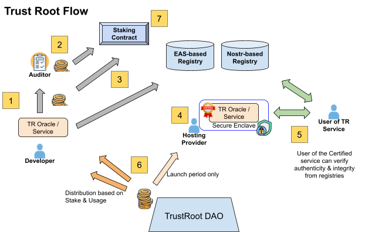

# 3. TrustRoot Protocol Overview

## 3.1 Core Components
TrustRoot is a protocol-only layer that provides:
- **Immutable Registries:** Using Ethereum Attestation Service (EAS) and Nostr relays to store attestations, source code hashes, and agent metadata.
- **SDK:** Tools for querying registries, managing certifications, and integrating with Secure Enclaves.
- **Certification Standards:** Requirements for transparency (e.g., source code hashes), authenticity (e.g., attestor validation), and tamper-proof verifiability (e.g., Secure Enclave usage).
- **$TROOT Token:** Incentivizes ecosystem participation, governance, and accountability.

TrustRoot does not build solutions like oracles or agents directly but enables third-party projects to create them, ensuring a scalable ecosystem.

## 3.2 Technical Architecture
The TrustRoot Protocol is composed of several core components that work together to enable trusted interactions.

### 3.2.1 EAS Registry for On-Chain Attestations
The EAS Registry, deployed on an Ethereum L2 (e.g., Optimism), serves as the primary on-chain registry for high-value or high-risk agents and oracles, storing immutable attestations such as source code hashes, Secure Enclave attestations, and community validations. It ensures maximum security and transparency for critical applications (e.g., DeFi price feeds), where trust and auditability are paramount. Registration on the EAS Registry requires staking $TROOT and paying an ETH fee, reflecting the higher cost of on-chain immutability.

### 3.2.2 Nostr Registry for Off-Chain Attestations
The Nostr Registry leverages the Nostr network as an off-chain, immutable registry for lower-value or lower-risk agents and services, offering a cost-effective alternative to the EAS Registry. Developers can register their agents/oracles on Nostr by publishing their source code hash, Secure Enclave attestation, and metadata as a signed Nostr event, which is replicated across Nostr relays for immutability and availability. This approach minimizes costs (no ETH fees) while maintaining sufficient trust for less critical applications (e.g., social moderation agents). The Nostr Registry also facilitates fast, scalable messaging for agent interactions, such as signed requests, enhancing DDoS protection and enabling low-latency communication.

### 3.2.3 Attestation Query Interface
The Attestation Query Interface allows agents and users to query the EAS Registry, verifying certifications and attestations before interacting with counterparties.

### 3.2.4 TrustRoot Certification
TrustRoot Certification is achieved by registering an agent’s source code hash and Secure Enclave attestation in the EAS Registry, undergoing attestor review, and receiving community validation via governance. Certified agents generate Nostr key pairs in a Secure Enclave, ensuring tamper-proof execution and secure communication.

### 3.2.5 Registration Interface
The Registration Interface enables developers to certify their agent/oracle by registering it on either the EAS Registry or the Nostr Registry, depending on the agent’s value and risk profile. For high-value or high-risk agents (e.g., DeFi price feeds), developers stake $TROOT (e.g., 500 $TROOT each for developer and auditor) and pay an ETH fee to register on the EAS Registry, achieving TrustRoot Certification. For lower-value or lower-risk agents (e.g., social moderation bots), developers can register on the Nostr Registry by publishing a signed Nostr event, which requires staking a smaller amount of $TROOT (e.g., 100 $TROOT each) and no ETH fee, reflecting the lower cost of off-chain registration. The Registration Interface ensures flexibility, allowing developers to balance cost and security based on their use case.

### 3.2.6 Secure Enclave Integration
Secure Enclaves (e.g., Intel SGX) ensure tamper-proof execution of agent code and key generation, surpassing SSL/TLS security by preventing unauthorized decryption.

### 3.2.7 $TROOT Token Model
The $TROOT token plays a central role in incentivizing ecosystem participation, ensuring trust, and supporting governance. Below is the detailed token economics model, including supply and allocations.

#### Token Supply and Allocations
- **Total Supply:** 1,000,000,000 $TROOT
- **Allocation Breakdown:**
  - 40% Ecosystem Incentives (400M $TROOT):
    - 15% Hosting Provider Grants (150M $TROOT): Distributed during the Launch Period to incentivize hosting providers running Secure Enclaves.
    - 20% Developer and Auditor Rewards (200M $TROOT): Distributed based on usage, staking, and governance votes for certified agents/oracles.
    - 5% Insurance Fund (50M $TROOT): Funded by 25% of registry fees to compensate users in case of agent/oracle failures.
  - 20% Governance and Community (200M $TROOT): For governance participation rewards (e.g., 5% annualized yield for staked $TROOT) and community initiatives (e.g., TrustRoot Oracle Challenge).
  - 15% Team and Advisors (150M $TROOT): For the TrustRoot team and advisors, with a 2-year vesting schedule.
  - 15% Ecosystem Development Fund (150M $TROOT): For partnerships, integrations, and future ecosystem growth, managed by governance.
  - 10% Reserve (100M $TROOT): Held for future needs (e.g., additional incentives, protocol upgrades), controlled by governance.

#### Vesting and Distribution Schedule
- **Ecosystem Incentives:** Distributed over 3 years, starting with the Launch Period (first 12 months).
- **Governance and Community:** Distributed over 5 years, tied to participation (e.g., voting, staking).
- **Team and Advisors:** 2-year vesting with a 6-month cliff, starting Q3 2025.
- **Ecosystem Development Fund:** Disbursed via governance votes, starting Q4 2025.
- **Reserve:** Locked until Q3 2026 (mainnet launch), then managed by governance.

#### Launch Period (First 12 Months)
- **Grants to Hosting Providers:**
  - Months 1-6: 1,000 $TROOT per provider.
  - Months 7-12: 500 $TROOT per provider.
  - After 12 months: Transition to user payments (e.g., in ETH, stablecoins, or third-party tokens).
- Third-party projects must share 10% of their user fees with hosting providers, paid in $TROOT or ETH, ensuring long-term sustainability.
- Hosting providers can stake $TROOT to participate in governance, earning a 5% annualized yield.

#### Auditing and Registration
- **Auditing Process:** Developers building TrustRoot Oracles/Agents pay TrustRoot Auditors in $TROOT for code review and vouching (max 500 $TROOT per audit, set by governance). Auditors are vetted via governance to ensure decentralization; automated tools assist with initial code checks.
- **EAS Registry Registration:** Developers and auditors stake $TROOT (e.g., 500 $TROOT each for developer and auditor) and pay an ETH fee to register high-value or high-risk agents/oracles in the EAS Registry on an Ethereum L2 (e.g., Optimism). First 6 months: 50% discount on registration fees, funded by $TROOT grants.
- **Nostr Registry Registration:** For lower-value or lower-risk agents, developers and auditors stake a smaller amount of $TROOT (e.g., 100 $TROOT each) and publish a signed Nostr event to the Nostr Registry, incurring no ETH fee.
- **Rewards Distribution:** $TROOT rewards are distributed to developers and auditors based on:
  - 60% usage frequency (e.g., number of queries to the agent/oracle).
  - 30% staked $TROOT (capped at 5,000 $TROOT to prevent centralization).
  - 10% governance votes (rewarding high-impact projects).
  - Minimum reward: 50 $TROOT per certified agent/oracle.
- A public dashboard ensures reward transparency.

#### Insurance Fund
- Staked $TROOT acts as an insurance fund. If an agent/oracle fails (e.g., inaccurate data, tampering), the stake can be slashed, and funds compensate affected users.
- Slashing criteria (set by governance):
  - Proven malicious behavior (e.g., tampering with Secure Enclave).
  - Repeated inaccuracies (e.g., price deviation >5% from median, 3+ times in a month).
  - Failure to respond to signed requests (e.g., DDoS protection failure).
- Governance votes on slashing disputes; users claim compensation via a dApp interface.
- 25% of registry fees (in $TROOT) are burned, 25% fund the insurance pool.

#### Ecosystem Integration
- Third-party projects pay a small $TROOT fee (e.g., 10 $TROOT per 1,000 queries) to access the EAS Registry, ensuring $TROOT’s utility. Nostr Registry queries are free but less auditable.
- Projects can offer a 20% discount on their services if paid in $TROOT, encouraging cross-token integration.

**Purpose:** $TROOT incentivizes hosting providers, developers, and auditors, ensures trust through staking and insurance, and maintains utility in a protocol-only ecosystem where third-party projects may have their own tokens.

## 3.3 Protocol Workflow
The following workflow illustrates how the TrustRoot protocol enables a third-party project to build a TrustRoot Oracle for DeFi price feeds:

1. A developer builds an oracle (e.g., for ETH/USD price feeds), submits it for auditing, and pays auditors in $TROOT (e.g., 500 $TROOT).
2. Auditors review the code, ensuring Secure Enclave compliance, and vouch for it, staking $TROOT to signal confidence (500 $TROOT for EAS registration, 100 $TROOT for Nostr registration).
3. The developer and auditor choose a registry based on the oracle’s risk profile:
   - **High-Value (EAS Registry):** For a DeFi price feed, they stake 500 $TROOT each and pay an ETH fee to register the oracle in the EAS Registry on Optimism, achieving TrustRoot Certification (50% fee discount in the first 6 months).
   - **Lower-Value (Nostr Registry):** For a less critical oracle (e.g., a gaming data feed), they stake 100 $TROOT each and publish a signed Nostr event to the Nostr Registry, incurring no ETH fee.
4. A hosting provider runs the certified oracle in a Secure Enclave, earning 1,000 $TROOT during the Launch Period (months 1-6).
5. A DeFi protocol (e.g., a lending platform) queries the oracle for price data, paying the third-party project (e.g., in their token, $TORC), which shares 10% with the hosting provider. If the oracle is on the EAS Registry, the protocol pays a small $TROOT fee (10 $TROOT per 1,000 queries) to access the registry; Nostr Registry queries are free but less auditable.
6. The oracle’s usage (e.g., 10,000 queries in a month) generates $TROOT rewards for the developer and auditor, distributed based on usage (60%), stake (30%), and governance votes (10%).
7. The staked $TROOT ensures reliability: if the oracle delivers inaccurate data (e.g., >5% deviation), governance can slash the stake and compensate affected users, with higher stakes (EAS) providing greater insurance.
